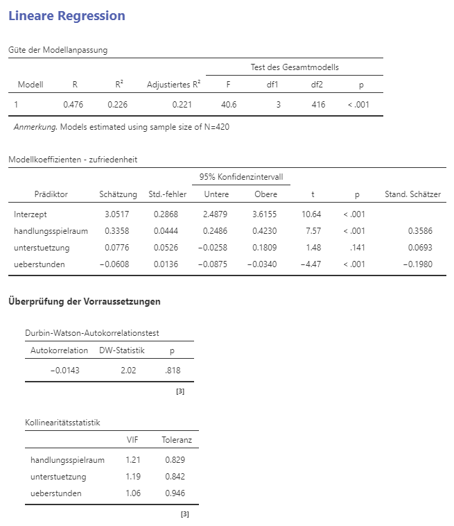

```{r}
#| include: false
library(webexercises)
```

Diese Probeprüfung hilft dir, deinen Lernstand zur linearen Regression
einzuschätzen. Die Aufgabentypen entsprechen denen der Prüfung:
Richtig-Falsch-Aussagen, Lückentexte und offene Fragen.

::: {.callout-note}
## So arbeitest du mit dieser Seite

- Beantworte die Fragen zuerst selbstständig, bevor du die Lösungen aufklappst.
- Bei den Richtig-Falsch- und Lückentext-Aufgaben erhältst du direkt eine
  Rückmeldung: richtige Antworten werden grün, falsche rot markiert.
- Bei den offenen Fragen vergleichst du deine Antwort mit der Musterlösung.
- Du brauchst für diese Probeprüfung **kein Jamovi**. Alle nötigen Ergebnisse
  stehen in den Ausgaben unten. Wenn du die Analysen selbst nachvollziehen
  möchtest, kannst du den Datensatz herunterladen:
  [arbeitszufriedenheit.csv](daten/arbeitszufriedenheit.csv).
- Rechne mit den Werten, wie sie in den Jamovi-Ausgaben stehen. Kleine
  Abweichungen durch Rundung sind bei den Antworten berücksichtigt.Verwende 
  einen Punkt "." als Dezimalzeichen. 
:::

## Ausgangsmaterial

::: {.callout-warning}
## Fiktive Daten
Der Datensatz ist simuliert. Er ist so konstruiert, dass die Ergebnisse
realistisch aussehen, taugt aber nicht als inhaltliche Evidenz zum Thema
Arbeitszufriedenheit.
:::

In Anlehnung an das Job-Demands-Resources-Modell wurde untersucht, wie
**Ressourcen** und **Anforderungen (Demands)** mit der Arbeitszufriedenheit
zusammenhängen. Befragt wurden 420 Beschäftigte eines
Dienstleistungsunternehmens.

| Variable | Rolle | Bedeutung | Wertebereich |
|:---|:---|:---|:---|
| `zufriedenheit` | Kriterium (AV) | Allgemeine Arbeitszufriedenheit, Mittelwertskala aus 6 Items | 1 = sehr unzufrieden bis 7 = sehr zufrieden |
| `handlungsspielraum` | Ressource (UV) | Erlebter Entscheidungs- und Handlungsspielraum, Mittelwertskala aus 5 Items | 1 bis 7 |
| `unterstuetzung` | Ressource (UV) | Soziale Unterstützung durch die vorgesetzte Person, Mittelwertskala aus 4 Items | 1 bis 7 |
| `ueberstunden` | Demand (UV) | Überstunden pro Woche | 0 bis 20 Stunden |

### Deskriptive Statistik

|                    | zufriedenheit | handlungsspielraum | unterstuetzung | ueberstunden |
|:-------------------|--------------:|-------------------:|---------------:|-------------:|
| N                  |           420 |                420 |            420 |          420 |
| Mittelwert         |          4.63 |               4.56 |           4.76 |         5.31 |
| Standardabweichung |          1.04 |               1.11 |           0.93 |         3.39 |
| Minimum            |          1.67 |               1.40 |           2.25 |            0 |
| Maximum            |          7.00 |               7.00 |           7.00 |           16 |

### Ausgabe A: Einfache lineare Regression

Kriterium `zufriedenheit`, Prädiktor `handlungsspielraum`.

{#fig-ausgabe-a fig-alt="Jamovi-Ausgabe. Güte der Modellanpassung: R gleich 0.427, R-Quadrat gleich 0.182, adjustiertes R-Quadrat gleich 0.180, F gleich 93.3 mit df1 gleich 1 und df2 gleich 418, p kleiner .001, N gleich 420. Modellkoeffizienten für zufriedenheit: Interzept mit Schätzung 2.806, Standardfehler 0.1945, Konfidenzintervall von 2.423 bis 3.188, t gleich 14.42, p kleiner .001. Handlungsspielraum mit Schätzung 0.400, Standardfehler 0.0414, Konfidenzintervall von 0.319 bis 0.481, t gleich 9.66, p kleiner .001, standardisierter Schätzer 0.427."}

### Ausgabe B: Multiple lineare Regression

Kriterium `zufriedenheit`, Prädiktoren `handlungsspielraum`, `unterstuetzung`
und `ueberstunden`.

{#fig-ausgabe-b fig-alt="Jamovi-Ausgabe. Güte der Modellanpassung: R gleich 0.476, R-Quadrat gleich 0.226, adjustiertes R-Quadrat gleich 0.221, F gleich 40.6 mit df1 gleich 3 und df2 gleich 416, p kleiner .001, N gleich 420. Modellkoeffizienten für zufriedenheit: Interzept 3.0517, Standardfehler 0.2868, Konfidenzintervall 2.4879 bis 3.6155, t gleich 10.64, p kleiner .001. Handlungsspielraum 0.3358, Standardfehler 0.0444, Konfidenzintervall 0.2486 bis 0.4230, t gleich 7.57, p kleiner .001, standardisierter Schätzer 0.3586. Unterstuetzung 0.0776, Standardfehler 0.0526, Konfidenzintervall minus 0.0258 bis 0.1809, t gleich 1.48, p gleich .141, standardisierter Schätzer 0.0693. Ueberstunden minus 0.0608, Standardfehler 0.0136, Konfidenzintervall minus 0.0875 bis minus 0.0340, t gleich minus 4.47, p kleiner .001, standardisierter Schätzer minus 0.1980. Durbin-Watson-Autokorrelationstest: Autokorrelation minus 0.0143, DW-Statistik 2.02, p gleich .818. Kollinearitätsstatistik: handlungsspielraum VIF 1.21 und Toleranz 0.829, unterstuetzung VIF 1.19 und Toleranz 0.842, ueberstunden VIF 1.06 und Toleranz 0.946."}

---

# Teil 1: Richtig oder falsch?

Entscheide für jede Aussage einzeln. 

## Aufgabe 1: Einfache Regression

Beziehe dich auf **Ausgabe A**.

::: {.webex-check .webex-box}

- `r mcq(c(answer = "richtig", "falsch"))` 18.2 % der Varianz der Arbeitszufriedenheit lassen sich durch den Handlungsspielraum aufklären.
- `r mcq(c("richtig", answer = "falsch"))` Die Korrelation zwischen Handlungsspielraum und Arbeitszufriedenheit beträgt r = .18.
- `r mcq(c(answer = "richtig", "falsch"))` Für eine Person mit einem Handlungsspielraum von 5 sagt das Modell eine Arbeitszufriedenheit von 4.81 vorher.
- `r mcq(c("richtig", answer = "falsch"))` Der Achsenabschnitt gibt die erwartete Arbeitszufriedenheit bei einem Handlungsspielraum von 0 an und ist hier inhaltlich gut interpretierbar.
- `r mcq(c("richtig", answer = "falsch"))` Da p < .001 ist, ist belegt, dass mehr Handlungsspielraum zu höherer Arbeitszufriedenheit führt.

:::

`r hide("Erklärung zur Lösung")`
- **R² = .182** ist der Anteil der Varianz der Arbeitszufriedenheit, der durch
  den Handlungsspielraum aufgeklärt wird, also 18.2 %.
- Die Korrelation ist die **Wurzel** aus R²: $\sqrt{.182} = .43$. Der Wert .18
  ist R², nicht r. In Ausgabe A steht die Korrelation auch direkt oben als
  R = 0.427. Weil es nur einen Prädiktor gibt, entspricht ihr hier auch der
  standardisierte Schätzer von 0.427.
- Vorhersage: $2.806 + 0.400 \cdot 5 = 4.81$.
- Rechnerisch stimmt die Aussage zum Achsenabschnitt, inhaltlich aber nicht: Die
  Skala beginnt bei 1, der kleinste beobachtete Wert liegt bei 1.40. Ein
  Handlungsspielraum von 0 kommt gar nicht vor, der Achsenabschnitt ist hier
  also ein reiner Hilfswert (Extrapolation über den Datenbereich hinaus).
- Ein kleiner p-Wert sagt nichts über Kausalität. Die Daten stammen aus einer
  Querschnittsbefragung ohne Intervention. Wir können also nichts über die 
  Kausalität aussagen. 
`r unhide()`

## Aufgabe 2: Koeffizienten der multiplen Regression

Beziehe dich auf **Ausgabe B**.

::: {.webex-check .webex-box}

- `r mcq(c(answer = "richtig", "falsch"))` Pro zusätzlichem Skalenpunkt Handlungsspielraum steigt die Arbeitszufriedenheit um durchschnittlich 0.3358 Punkte, wenn Unterstützung und Überstunden konstant gehalten werden.
- `r mcq(c("richtig", answer = "falsch"))` Der Vergleich der unstandardisierten Koeffizienten (0.3358 gegenüber −0.0608) zeigt, dass die Überstunden den schwächsten Effekt haben.
- `r mcq(c(answer = "richtig", "falsch"))` Der Effekt von `unterstuetzung` ist statistisch nicht signifikant; das 95 %-Konfidenzintervall schliesst die Null ein.
- `r mcq(c(answer = "richtig", "falsch"))` Mehr Überstunden gehen im Mittel mit geringerer Arbeitszufriedenheit einher – bei gleichem Handlungsspielraum und gleicher Unterstützung.
- `r mcq(c("richtig", answer = "falsch"))` Der nicht signifikante p-Wert von `unterstuetzung` beweist, dass es in der Population keinen Zusammenhang gibt.
- `r mcq(c("richtig", answer = "falsch"))` Das 95 %-Konfidenzintervall von `handlungsspielraum` bedeutet, dass Werte unter 0.2486 mit den Daten gut vereinbar sind.

:::

`r hide("Erklärung zur Lösung")`
- Der Koeffizient einer multiplen Regression ist immer ein
  **Ceteris-paribus-Effekt**: Er gilt unter der Annahme, dass die anderen
  Prädiktoren unverändert bleiben.
- Die unstandardisierten Koeffizienten sind hier **nicht vergleichbar**: 0.3358
  bezieht sich auf einen Skalenpunkt, −0.0608 auf eine Überstunde pro Woche. Die
  standardisierten Koeffizienten zeigen das Gegenteil der Aussage: Mit
  β = −.198 sind die Überstunden der zweitstärkste Prädiktor, am schwächsten ist
  die Unterstützung mit β = .069.
- Bei `unterstuetzung` ist p = .141 und das Intervall reicht von −0.0258 bis
  0.1809, schliesst also die Null ein. Ein nicht signifikantes Ergebnis heisst
  aber nur, dass die Nullhypothese nicht verworfen wird – es ist **kein Beleg
  dafür, dass der Effekt null ist**. Hier sind auch Effekte bis 0.1809
  Skalenpunkte mit den Daten vereinbar.
- Werte **innerhalb** des Konfidenzintervalls sind mit den Daten gut vereinbar,
  Werte ausserhalb (also unter 0.2486) gerade nicht.
`r unhide()`

## Aufgabe 3: Modellgüte

Beziehe dich auf **Ausgabe B**.

::: {.webex-check .webex-box}

- `r mcq(c(answer = "richtig", "falsch"))` Die drei Prädiktoren klären zusammen 22.6 % der Varianz der Arbeitszufriedenheit auf.
- `r mcq(c("richtig", answer = "falsch"))` R² = .226 heisst, dass 22.6 % der Befragten korrekt vorhergesagt werden.
- `r mcq(c(answer = "richtig", "falsch"))` Das adjustierte R² ist kleiner als R², weil es die Anzahl der Prädiktoren berücksichtigt.
- `r mcq(c(answer = "richtig", "falsch"))` Der F-Test prüft, ob das Modell insgesamt mehr Varianz aufklärt, als bei reinen Zufallsvariablen zu erwarten wäre.
- `r mcq(c("richtig", answer = "falsch"))` Auch bei der multiplen Regression entspricht R² dem quadrierten Korrelationskoeffizienten zwischen einem einzelnen Prädiktor und dem Kriterium.

:::

`r hide("Erklärung zur Lösung")`
R² bezieht sich immer auf **Varianz**, nicht auf Personen oder Fälle. Bei der
einfachen Regression entspricht R² tatsächlich der quadrierten Korrelation
zwischen UV und AV (Ausgabe A: $0.427^2 = 0.182$). Bei der multiplen Regression
ist R² dagegen die quadrierte Korrelation zwischen den **beobachteten und den
vorhergesagten Werten** (multiples R = .476).
`r unhide()`

## Aufgabe 4: Voraussetzungen und Diagnostik

::: {.webex-check .webex-box}

- `r mcq(c("richtig", answer = "falsch"))` Die abhängige Variable muss normalverteilt sein.
- `r mcq(c(answer = "richtig", "falsch"))` Die Residuen sollen näherungsweise normalverteilt sein.
- `r mcq(c(answer = "richtig", "falsch"))` Mit VIF-Werten von 1.06 bis 1.21 ist Multikollinearität in Ausgabe B unproblematisch.
- `r mcq(c(answer = "richtig", "falsch"))` Die Durbin-Watson-Statistik von 2.02 spricht gegen eine Abhängigkeit der Fehlerwerte.
- `r mcq(c("richtig", answer = "falsch"))` Heteroskedastizität verzerrt in erster Linie die geschätzten Regressionskoeffizienten.
- `r mcq(c(answer = "richtig", "falsch"))` Ein trichterförmiges Muster im Diagramm der Residuen gegen die vorhergesagten Werte deutet auf eine Verletzung der Homoskedastizität hin.

:::

`r hide("Erklärung zur Lösung")`
Normalverteilt sein sollen **nur die Fehlerwerte (Residuen)**, weder die
Prädiktoren noch das Kriterium. Als Faustregel für Multikollinearität gilt
VIF < 10, für die Durbin-Watson-Statistik ein Wert zwischen 1 und 3.

Sowohl eine verletzte Normalverteilung der Residuen als auch Heteroskedastizität
verfälschen **nicht die Koeffizienten**, sondern deren **Standardfehler** – und
damit p-Werte und Konfidenzintervalle.
`r unhide()`

## Aufgabe 5: Grundlagen und Vorgehen

::: {.webex-check .webex-box}

- `r mcq(c(answer = "richtig", "falsch"))` OLS bestimmt die Gerade mit der kleinsten Summe der quadrierten Residuen.
- `r mcq(c(answer = "richtig", "falsch"))` Ein Residuum ist der tatsächliche (beobachtete) Wert minus den vorhergesagten Wert.
- `r mcq(c("richtig", answer = "falsch"))` Schrittweise Verfahren (Stepwise Regression) sind das empfohlene Standardvorgehen zur Auswahl der Prädiktoren.
- `r mcq(c(answer = "richtig", "falsch"))` Bei verletzter Normalverteilung der Residuen ist Bootstrapping eine mögliche Vorgehensweise.

:::

`r hide("Erklärung zur Lösung")`
Ein **positives Residuum** bedeutet, dass die Person zufriedener ist, als das
Modell vorhersagt; ein negatives Residuum, dass sie unzufriedener ist. Die
Regressionsgerade minimiert die Summe der **quadrierten** Residuen – dadurch
fallen grosse Abweichungen stärker ins Gewicht als kleine.
`r unhide()`

---

# Teil 2: Lückentexte

Trage deine Antworten in die Felder ein. Pro Lücke gibt es 1 Punkt.
Zahlen bitte ohne Einheit eingeben, als Dezimaltrennzeichen dient der Punkt.

## Aufgabe 6: Ergebnisse beschreiben

Beziehe dich auf **Ausgabe B**.

::: {.webex-check .webex-box}

Das Gesamtmodell klärt `r fitb(22.6, tol = 0.1)` % der Varianz der
Arbeitszufriedenheit auf. Der Prädiktor mit dem stärksten Effekt ist
`r mcq(c(answer = "handlungsspielraum", "unterstuetzung", "ueberstunden"))`.
Der Koeffizient bei `ueberstunden` bedeutet, dass die
Arbeitszufriedenheit pro zusätzlicher Überstunde pro Woche um
`r fitb(c("0.0608", "0.061", "0.06"))` Skalenpunkte
`r mcq(c("steigt", answer = "sinkt"))`.

:::

## Aufgabe 7: Werte vorhersagen

Eine Person gibt einen Handlungsspielraum von 5 an, eine Unterstützung von 4
und leistet 6 Überstunden pro Woche. Verwende **Ausgabe B**.

::: {.webex-check .webex-box}

Die Regressionsgleichung lautet:
$\hat{y} =$ `r fitb(3.05, tol = 0.01)` $+$ `r fitb(0.336, tol = 0.005)` $\cdot \text{handlungsspielraum} + 0.0776 \cdot \text{unterstuetzung} - 0.0608 \cdot \text{ueberstunden}$

Die vorhergesagte Arbeitszufriedenheit beträgt `r fitb(4.68, tol = 0.03)`.

:::

`r hide("Rechenweg anzeigen")`
$$
\hat{y} = 3.05 + 0.336 \cdot 5 + 0.0776 \cdot 4 - 0.0608 \cdot 6
$$
$$
\hat{y} = 3.05 + 1.68 + 0.31 - 0.36 = 4.68
$$

Beachte: Auch der nicht signifikante Prädiktor `unterstuetzung` geht in die
Vorhersage ein, solange er im Modell enthalten ist.
`r unhide()`

## Aufgabe 8: Residuum

Die Person aus Aufgabe 7 gibt tatsächlich eine Arbeitszufriedenheit von 5.33 an.

::: {.webex-check .webex-box}

Ihr Residuum beträgt `r fitb(0.65, tol = 0.03)` Skalenpunkte. Die Person ist
also `r mcq(c(answer = "zufriedener", "unzufriedener"))` als vom Modell vorhergesagt.

:::

`r hide("Rechenweg anzeigen")`
Das Residuum ist der tatsächliche (beobachtete) Wert minus den vorhergesagten
Wert:
$$
e = y - \hat{y} = 5.33 - 4.68 = 0.65
$$
Ein **positives** Residuum heisst: Die Person liegt über der Regressionsgeraden,
ist also zufriedener, als das Modell erwarten lässt.
`r unhide()`

## Aufgabe 9: Standardisierte Koeffizienten

::: {.webex-check .webex-box}

Standardisierte Koeffizienten verwenden für alle Variablen die
`r fitb(c("Standardabweichung", "Standardabweichungen", "SD"), ignore_case = TRUE, width = 22)`
als Einheit. Sie geben an, um wie viele
`r fitb(c("Standardabweichungen", "Standardabweichung", "SD"), ignore_case = TRUE, width = 22)`
sich das Kriterium verändert, wenn sich der Prädiktor um eine Einheit dieser
Grösse verändert und alle anderen Prädiktoren
`r mcq(c(answer = "unverändert bleiben", "gleich stark steigen", "aus dem Modell entfernt werden"))`.

:::

`r hide("Nachgerechnet")`
Du kannst die standardisierten Koeffizienten aus der deskriptiven Statistik
nachrechnen:
$$
\beta_j = b_j \cdot \frac{s_{x_j}}{s_y} = 0.3358 \cdot \frac{1.11}{1.04} = 0.3586
$$
`r unhide()`

## Aufgabe 10: Voraussetzungen prüfen in Jamovi

::: {.webex-check .webex-box}

Die Linearität prüfen wir über einen
`r mcq(c(answer = "Scatterplot", "Boxplot", "Q-Q-Plot"))`
mit einer `r fitb(c("LOESS", "Loess", "LOWESS"), ignore_case = TRUE, width = 10)`-Linie.
Ob die Residuen normalverteilt sind, sehen wir im
`r mcq(c("Scatterplot", "Histogramm der AV", answer = "Q-Q-Plot oder Histogramm der Residuen"))`.
Die Unabhängigkeit der Fehlerwerte prüfen wir mit der
`r fitb(c("Durbin-Watson", "Durbin Watson", "Durbin-Watson-Statistik"), ignore_case = TRUE, width = 20)`-Statistik.

:::

`r hide("Wo finde ich das in Jamovi?")`
- **Scatterplot mit LOESS**: Analysen > JJStatsPlot > Scatter Plot
- **Q-Q-Plot, Residuendiagramme, Durbin-Watson und Kollinearitätsstatistik**:
  direkt im Menü der linearen Regression unter «Annahmeprüfungen»
- **Residuen speichern** (z. B. für ein Histogramm): im Menü der Regression
  unter «Speichern» die «Residuen» anwählen
`r unhide()`

## Aufgabe 11: Begriffe der Regressionsgleichung

Gegeben ist die Gleichung $y = b_0 + b_1 x_1 + b_2 x_2 + e$.

::: {.webex-check .webex-box}

$b_0$ heisst `r mcq(c(answer = "Achsenabschnitt", "Steigung", "Residuum"))`,
$b_1$ und $b_2$ heissen `r mcq(c("Achsenabschnitte", answer = "Regressionskoeffizienten", "Standardfehler"))`
und $e$ steht für das `r fitb(c("Residuum", "Residuen", "Fehler", "Fehlerwert"), ignore_case = TRUE, width = 14)`.
Der Koeffizient $b_1$ gibt den Effekt von $x_1$ unter sonst gleichen Bedingungen
an, lateinisch `r fitb(c("ceteris paribus", "ceteris-paribus"), ignore_case = TRUE, width = 18)`.

:::


---

# Teil 3: Offene Fragen

Formuliere deine Antwort zuerst selbst und vergleiche sie dann mit der
Musterlösung.

## Aufgabe 12: Ergebnisbericht formulieren

Formuliere auf Basis von **Ausgabe B** einen Ergebnisabschnitt von vier bis
sechs Sätzen, wie er in einer Arbeit stehen könnte. Gehe auf das Gesamtmodell
und auf alle drei Prädiktoren ein.

`r hide("Musterlösung")`
Das Modell klärt einen signifikanten Anteil der Varianz der Arbeitszufriedenheit
auf, R² = .226, adj. R² = .221, F(3, 416) = 40.6, p < .001. Der
Handlungsspielraum hängt positiv mit der Arbeitszufriedenheit zusammen: Pro
zusätzlichem Skalenpunkt steigt sie bei konstant gehaltenen übrigen Prädiktoren
um durchschnittlich 0.34 Punkte, 95 %-CI [0.25, 0.42], p < .001. Die Überstunden
hängen negativ mit der Arbeitszufriedenheit zusammen, b = −0.06 Punkte pro
Überstunde, 95 %-CI [−0.09, −0.03], p < .001. [Optional, zur Veranschaulichung 
der absoluten Effektstärke]: Über eine Spannweite von 16 Überstunden entspricht 
das rund einem ganzen Skalenpunkt. Für die soziale
Unterstützung durch die vorgesetzte Person zeigte sich kein signifikanter
Zusammenhang, b = 0.08, p = .141. [Optional, zur Veranschaulichung des 
Konfidenzintervalls:] Das Konfidenzintervall schliesst allerdings
auch Effekte bis 0.18 Punkte ein. Anhand der standardisierten Koeffizienten ist
der Handlungsspielraum der stärkste Prädiktor (β = .36), gefolgt von den
Überstunden (β = −.20).

**Darauf kommt es an**

- Gesamtmodell mit R², adjustiertem R² und ggf. auch F-Test berichtet
- alle drei Koeffizienten in ihren Originaleinheiten interpretiert, inklusive
  Ceteris-paribus-Bedingung
- Signifikanzen korrekt eingeordnet
- nicht signifikanter Prädiktor korrekt formuliert, also ohne die Aussage, es
  gebe keinen Zusammenhang (weil: absence of evidence is not evidence of absence!)
`r unhide()`


## Aufgabe 13: Eine verletzte Voraussetzung

Im Diagramm der Residuen gegen die vorhergesagten Werte zeigt sich ein deutlich
trichterförmiges Muster: Bei hohen vorhergesagten Werten streuen die Residuen
stark, bei tiefen kaum.

a) Welche Voraussetzung ist verletzt?
b) Welche Ergebnisse der Regression sind betroffen und welche nicht?
c) Nenne eine mögliche Vorgehensweise.

`r hide("Musterlösung")`
a) Die **Homoskedastizität**. Die Varianz der Residuen ist nicht über den
   gesamten Wertebereich gleich.

b) Die geschätzten **Koeffizienten bleiben unverzerrt**. Verfälscht werden die
   **Standardfehler** und damit alles, was darauf aufbaut: t-Werte, p-Werte und
   Konfidenzintervalle. Aussagen zur Signifikanz sind also nicht mehr
   vertrauenswürdig.

c) **Bootstrapping** (alternativ: robuste Standardfehler oder eine
   Transformation der abhängigen Variable).
`r unhide()`

## Aufgabe 14: Assoziation oder Kausalität

Aus **Ausgabe A** folgt: «Die Arbeitszufriedenheit steigt durchschnittlich um
0.40 Punkte pro zusätzlichem Skalenpunkt Handlungsspielraum.» Zwei Personen
interpretieren das unterschiedlich:

- **Person A:** Wenn wir zwei Beschäftigte vergleichen und Person B erlebt einen
  Skalenpunkt mehr Handlungsspielraum, dann erwarten wir für B eine um 0.40
  Punkte höhere Arbeitszufriedenheit.
- **Person B:** Wenn wir den Arbeitsplatz einer Person so umgestalten, dass sie
  einen Skalenpunkt mehr Handlungsspielraum erlebt, dann steigt ihre
  Arbeitszufriedenheit um 0.40 Punkte.

Welche Interpretation ist durch die Analyse gedeckt? Begründe und nenne einen
konkreten Grund, weshalb die andere problematisch ist.

`r hide("Musterlösung")`
Gedeckt ist die Interpretation von **Person A**. Die Regression beschreibt einen
**Vergleich zwischen Beobachtungen**: Beschäftigte mit mehr erlebtem
Handlungsspielraum sind im Durchschnitt zufriedener.

Person B formuliert eine **kausale und kontrafaktische** Aussage darüber, was
passiert, wenn man bei derselben Person eingreift. Das lässt sich aus
Querschnittsdaten ohne Intervention nicht schliessen. Mögliche konkrete Gründe:

- **Drittvariablen**: Hierarchiestufe, Führungsqualität, Art der Tätigkeit oder
  Persönlichkeitsmerkmale (z. B. negative Affektivität) beeinflussen beides.
- **Umgekehrte Kausalität**: Wer zufrieden ist, nimmt den eigenen Spielraum
  möglicherweise grösser wahr, oder bekommt tatsächlich mehr Spielraum
  zugestanden.
- **Common-Method-Bias**: Beide Variablen stammen aus derselben Selbstauskunft
  zum selben Zeitpunkt.
`r unhide()`

## Aufgabe 15: Zwei Prädiktoren vergleichen

Ein Student schreibt: «Die Überstunden sind der unwichtigste Prädiktor, weil ihr
Koeffizient mit −0.0608 den kleinsten Betrag hat.» Nimm Stellung und begründe
mit den Zahlen aus **Ausgabe B**.

`r hide("Musterlösung")`
Die Aussage ist nicht haltbar. Unstandardisierte Koeffizienten hängen von der
**Einheit und der Streuung** des jeweiligen Prädiktors ab. Beim
Handlungsspielraum bedeutet «eine Einheit» einen Skalenpunkt auf einer
siebenstufigen Skala (SD = 1.11), bei den Überstunden eine einzelne Stunde pro
Woche bei einer Streuung von 3.39 Stunden. Über den beobachteten Bereich von 0
bis 16 Überstunden summiert sich der Effekt auf
$16 \cdot (-0.0608) = -0.97$ Skalenpunkte.

Der Vergleich gelingt über die **standardisierten Koeffizienten**: β = .3586 für
den Handlungsspielraum, β = −.1980 für die Überstunden und nur β = .0693 für die
Unterstützung. Die Überstunden sind also der zweitstärkste Prädiktor, nicht der
schwächste.
`r unhide()`

## Aufgabe 16: Regression oder Korrelation

Welche Informationen liefert eine einfache lineare Regression, die eine
Produkt-Moment-Korrelation nicht liefert? Nenne zwei Punkte und erkläre, wann
man deshalb die Regression wählt.

`r hide("Musterlösung")`
1. Die Regression liefert eine **Gleichung mit Achsenabschnitt und Steigung in
   den Originaleinheiten**. Sie quantifiziert den Zusammenhang also inhaltlich
   («0.40 Skalenpunkte Zufriedenheit pro Skalenpunkt Handlungsspielraum») und
   erlaubt konkrete **Vorhersagen**.
2. Die Regression lässt sich um **weitere Prädiktoren erweitern**. Damit können
   Störvariablen kontrolliert und Effekte ceteris paribus geschätzt werden.

Die Korrelation liefert nur Richtung und Stärke des Zusammenhangs und ist
symmetrisch, unterscheidet also nicht zwischen UV und AV. Die Regression wählt
man deshalb immer dann, wenn eine gerichtete Fragestellung vorliegt, wenn
vorhergesagt werden bzw. der Zusammenhang anhand konkreter Einheiten 
quantifiziert werden soll oder wenn weitere Variablen berücksichtigt werden
müssen.
`r unhide()`

## Aufgabe 17: Schrittweise Regression

Eine Kollegin schlägt vor, aus 20 verfügbaren Variablen per schrittweiser
Regression automatisch die besten Prädiktoren auswählen zu lassen. Was
entgegnest du? Nenne zwei Gründe und einen Alternativvorschlag.

`r hide("Musterlösung")`
1. Schrittweise Verfahren liefern **instabile Resultate**. Welche Variablen im
   Modell landen, hängt stark von Zufallsschwankungen der Stichprobe ab; eine
   neue Stichprobe führt oft zu einem anderen Modell.
2. Die resultierenden **p-Werte und Konfidenzintervalle dürfen nicht wie üblich
   interpretiert werden**, weil dieselben Daten sowohl für die Auswahl der
   Variablen als auch für deren Testung verwendet wurden.

**Alternative:** theoriegeleitete Auswahl der Prädiktoren mit Einschluss
(ENTER), gestützt auf bestehende Literatur und inhaltliche Überlegungen. Wird
bewusst explorativ gearbeitet, muss das als solches deklariert und das Ergebnis
idealerweise an neuen Daten überprüft werden.
`r unhide()`

---

::: {.callout-tip}
## Und jetzt?

Wenn dir einzelne Aufgaben schwergefallen sind, lohnt sich ein Blick in die
entsprechenden Folien der Sitzungen zur Regressionsanalyse. Inhalte aus den 
Bachelor-Vorlesungen finden sich unter 
<a href="https://djfgerber.github.io/aps_statistik1/index.html" target="_blank">Quantitative Methoden 2</a> 
oder
<a href="https://mdsteiner.github.io/quantitative_methoden_3/" target="_blank">Quantitative Methoden 3</a>

:::
