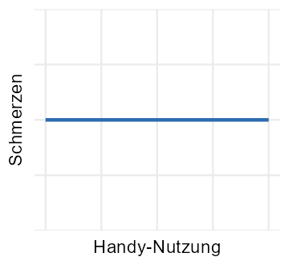
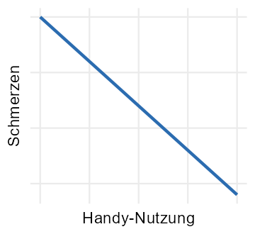
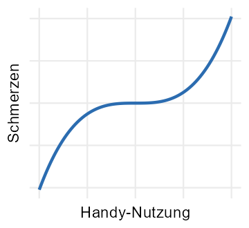
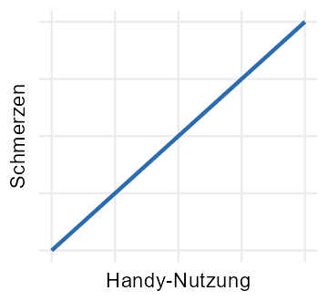
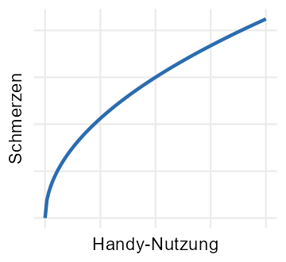

```{r}
#| include: false
library(webexercises)
library(ggplot2)
```

In den kommenden Sitzungen werden wir Regressionsanalysen vertiefen. Dazu
solltest du mit dem einfachen linearen Modell vertraut sein, bevor wir in die
nächste Sitzung starten.

## Eine Fragestellung aus der Praxis

Nacken- und Rückenschmerzen nehmen in allen Bevölkerungsschichten zu, auch unter
jungen Erwachsenen. Du hast nun die Vermutung, dass auch die Handy-Nutzung hier
eine Rolle spielen könnte, da während dieser häufig eine ungünstige Körperhaltung
eingenommen wird. Du vermutest also, dass Nacken- und Rückenschmerzen mit der
Handynutzung zunehmen, und befragst Studierende zu ihrer durchschnittlichen
Handynutzung (in Stunden pro Tag) und ihren Nacken- und Rückenschmerzen
(validierte Summenskala von 0 [keine Schmerzen] bis 10 [starke Schmerzen]).

### Welches Verfahren passt?

Welche der folgenden Verfahren sind geeignet, um deine Fragestellung zu
untersuchen? Entscheide für jedes Verfahren einzeln und klicke anschliessend auf
**„Antworten prüfen"**.

::: {.webex-check .webex-box}

- `r mcq(c(answer = "geeignet", "nicht geeignet"))` Einfache lineare Regression 
- `r mcq(c(answer = "geeignet", "nicht geeignet"))`Produkt-Moment-Korrelation (Pearson-Korrelation) 
- `r mcq(c("geeignet", answer = "nicht geeignet"))` ANOVA 
- `r mcq(c("geeignet", answer = "nicht geeignet"))` Chi-Quadrat-Test 

:::

`r hide("Erklärung zur Lösung")`
**Warum nicht ANOVA oder Chi-Quadrat-Test?**

Beide Variablen sind hier stetig (Stunden bzw. Schmerz-Summenwert). Die **ANOVA**
vergleicht dagegen Mittelwerte zwischen *Gruppen*, bräuchte also einen
kategorialen Prädiktor. Der **Chi-Quadrat-Test** prüft Zusammenhänge zwischen
*kategorialen* Merkmalen (Häufigkeiten in einer Kreuztabelle). Für zwei stetige
Variablen sind beide nicht das passende Werkzeug.
`r unhide()`


Sowohl die Produkt-Moment-Korrelation als auch eine einfache lineare Regression
können dir angeben, ob Schmerzen mit der Handy-Nutzung zunehmen. Beide gehen
dabei davon aus, dass der Zusammenhang zwischen den beiden Variablen linear ist,
d. h., dass sich die Schmerzen immer gleich stark ändern, wenn sich die
Handy-Nutzung ändert.


### Welche Zusammenhänge sind linear?

Welche der folgenden Diagramme zeigen einen linearen Zusammenhang zwischen
Handy-Nutzung und Schmerzen?

```{r}
#| label: fig-zusammenhaenge-setup
#| include: false

x <- seq(0, 8, length.out = 120)
dat <- rbind(
  data.frame(d = "A", x = x, y = 5),
  data.frame(d = "B", x = x, y = 10 - 2 * x),
  data.frame(d = "C", x = x, y = 5 + 0.08 * (x - 4)^3),
  data.frame(d = "D", x = x, y = 2 + 0.5 * x),
  data.frame(d = "E", x = x, y = 3 * sqrt(x))
)

dir.create("images", showWarnings = FALSE)

for (buchstabe in unique(dat$d)) {
  p <- ggplot(dat[dat$d == buchstabe, ], aes(x, y)) +
    geom_line(linewidth = 1, colour = "#2b6cb0") +
    labs(x = "Handy-Nutzung", y = "Schmerzen") +
    theme_minimal(base_size = 11) +
    theme(
      axis.text = element_blank(),
      axis.ticks = element_blank(),
      panel.grid.minor = element_blank()
    )
  ggsave(
    filename = file.path("images", paste0("zusammenhang-", buchstabe, ".png")),
    plot = p, width = 2.4, height = 2.2, dpi = 150
  )
}
```

*Fünf mögliche Verläufe zwischen Handy-Nutzung (x) und Schmerzen (y).*

Klicke auf alle Diagramme, die einen linearen Zusammenhang zeigen, und klicke
anschliessend auf **„Antworten prüfen"**.

<div class="image-quiz">
<div class="image-quiz-grid">
<button type="button" class="image-quiz-item" data-correct="true" aria-label="Diagramm A">

<span class="image-quiz-label" aria-hidden="true">A</span>
</button>
<button type="button" class="image-quiz-item" data-correct="true" aria-label="Diagramm B">

<span class="image-quiz-label" aria-hidden="true">B</span>
</button>
<button type="button" class="image-quiz-item" data-correct="false" aria-label="Diagramm C">

<span class="image-quiz-label" aria-hidden="true">C</span>
</button>
<button type="button" class="image-quiz-item" data-correct="true" aria-label="Diagramm D">

<span class="image-quiz-label" aria-hidden="true">D</span>
</button>
<button type="button" class="image-quiz-item" data-correct="false" aria-label="Diagramm E">

<span class="image-quiz-label" aria-hidden="true">E</span>
</button>
</div>
<div class="image-quiz-controls">
<button type="button" class="image-quiz-check-btn">Antworten prüfen</button>
<button type="button" class="image-quiz-reset-btn">Zurücksetzen</button>
<span class="image-quiz-result" aria-live="polite"></span>
</div>
</div>

`r hide("Erklärung zur Lösung")`
Linear sind die Diagramme **A, B und D**: Alle drei sind Geraden, bei denen sich
die Schmerzen bei jeder zusätzlichen Stunde Handy-Nutzung um denselben Betrag
ändern. **C** (S-förmiger Verlauf) und **E** (gekrümmt ansteigend) sind nicht
linear — dort hängt die Wirkung einer zusätzlichen Stunde vom Ausgangsniveau ab.

Ein Sonderfall ist **A** (Steigung 0): Die Gerade ist zwar linear, zeigt aber
*keinen Zusammenhang* — die Schmerzen bleiben unabhängig von der Handy-Nutzung
gleich. Eine lineare Regression liesse sich hier problemlos anwenden, sie würde
lediglich eine Steigung von ungefähr null schätzen.
`r unhide()`

Während sowohl die Produkt-Moment-Korrelation als auch die einfache lineare Regression dir sagen können, ob Schmerzen mit der Handy-Nutzung zunehmen, liefern dir die beiden Verfahren unterschiedlich viel Informationen. Die Korrelation sagt dir, ob ein signifikanter Zusammenhang zwischen den beiden Variablen besteht, ob dieser positiv (Schmerzen steigen mit Handy-Nutzung) oder negativ ist (Schmerzen sinken mit Handy-Nutzung) und wie eng dieser Zusammenhang ist. 

Die lineare Regression sagt dir zusätzlich, wie stark die Schmerzen steigen, wenn die Handy-Nutzung zunimmt. Und sie sagt dir auch, wie viel Schmerzen eine Person durchschnittlich hat, abhängig davon, wie hoch ihre Handy-Nutzung ist. Dazu schätzt die lineare Regression ein sogenanntes *lineares Modell*.


## Das lineare Modell

Das einfache lineare Modell beschreibt einen Zusammenhang zwischen einer
Ergebnisvariable $y$ (in unserem Beispiel Schmerz) und einer Prädiktorvariable $x$ (in unserem Beispiel Handy-Nutzung). Weil unser Modell versucht, die Ergebnisvariable anhand der Prädiktorvariable zu schätzen, ist die Ergebnisvariable mit einem Dach (Circumflex) versehen:

$$
\hat{y} = \beta_0 + \beta_1 x
$$

Dabei ist $\beta_0$ der Achsenabschnitt und $\beta_1$ die Steigung. 

Alternativ können wir die geschätzte Ergebnisvariable $\hat{y}$ auch durch die 
*tatsächliche* Ergebnisvariable $y$ ersetzen. Dann müssen wir aber den Fehlerterm 
(das Residuum) $\varepsilon$ ergänzen, weil die Schätzung des linearen Modells
wahrscheinlich etwas daneben liegt (also einen Vorhersage*fehler* macht). 

$$
y = \beta_0 + \beta_1 x + \varepsilon
$$

Die Steigung $\beta_1$ sagt uns, um wie viele Einheiten sich die Ergebnisvariable verändert, wenn die Prädiktorvariable um eine Einheit steigt. In unserem Beispiel sagt die Stegung uns also, um wie viele Punkte der Skala sich Schmerzen verändern, wenn 
die Handy-Nutzung um eine Stunde zunimmt. 


::: {.webex-check .webex-box}

Nehmen wir an, du schätzt eine einfache lineare Regression und findest heraus, dass die Steigung $\beta_1$ für dein Regressionsmodell 0.5 beträgt. Was wäre dann die korrekte Aussage?

Wenn Handy-Nutzung um eine `r mcq(c("Sekunde", "Minute", answer = "Stunde"))` zunimmt, 
dann `r mcq(c(answer = "steigt", "sinkt"))` der Schmerz um `r mcq(c("5", "0.5", answer = "0.5 Punkte der Schmerzskala"))`.

Nehmen wir nun an, du findest heraus dass $\beta_1 = -0.2$ Was wäre dann die korrekte Aussage?

Wenn Handy-Nutzung um eine `r mcq(c("Sekunde", "Minute", answer = "Stunde"))` zunimmt, 
dann `r mcq(c("steigt", answer = "sinkt"))` der Schmerz um `r mcq(c("0.2", answer = "0.2 Punkte der Schmerzskala", "0.2 Ouchies"))`.

:::

Der Achsenabschnitt $\beta_0$ sagt uns, wie hoch die Schmerzen einer Person durchschnittlich sind, welche 0 Stunden Handy-Nutzung hat.(Weil wenn $x = 0$, dann gilt $\hat{y} = \beta_0 + \beta_1 \cdot 0 = \beta_0$.)


### Erwartete Werte berechnen

Gemeinsam definieren die Steigung und der Achsenabschnitt das lineare Modell, welches den Zusammenhang zwischen $x$ (Handy-Nutzung) und $y$ (Schmerzen) beschreibt.  Nehmen wir mal an, deine Regressionsanalyse ergibt, dass der Achsenabschnitt $\beta_0$ 2 beträgt und die Steigung $\beta_1$ 0.5. Dann lautet das lineare Modell: $\hat{y} = 2 + 0.5 \cdot x$

Anhand dieses linearen Modells können wir für eine gegebene Person berechnen, wie viele Punkte auf der Schmerzskala wir für sie erwawrten, wenn wir ihre durchschnittliche Handy-Nutzung kennen. 

Berechne den erwarteten
Schmerzwert $\hat{y}$ für die folgenden Werte von $x$ (Handy-Nutzung in
Stunden pro Tag):

::: {.webex-check .webex-box}

- Für $x = 3$: $\hat{y} =$ `r fitb(3.5, tol = 0.01)`
- Für $x = 8$: $\hat{y} =$ `r fitb(6, tol = 0.01)`
- Für $x = 0$: $\hat{y} =$ `r fitb(2, tol = 0.01)`

:::

`r hide("Rechenweg anzeigen")`
Setze die jeweiligen $x$-Werte in $\hat{y} = 2 + 0.5 \cdot x$ ein:

- $x = 3$: $\hat{y} = 2 + 0.5 \cdot 3 = 2 + 1.5 = 3.5$
- $x = 8$: $\hat{y} = 2 + 0.5 \cdot 8 = 2 + 4 = 6$
- $x = 0$: $\hat{y} = 2 + 0.5 \cdot 0 = 2 + 0 = 2$

Beachte: Bei $x = 0$ entspricht $\hat{y}$ genau dem Achsenabschnitt
$\hat{\beta}_0$ – das ist der erwartete Schmerzwert bei völliger
Handy-Abstinenz.
`r unhide()`

Das einfache lineare Modell lässt sich auch als eine Linie grafisch darstellen. 
Der Achsenabschnitt $\beta_0$ gibt hier an, wo die Linie die y-Achse kreuzt (von hier kommt der Name). 
Die Steigung $\beta_1$ gibt an, wie steil die Linie steigt (bzw. sinkt, wenn $\beta_1 < 0$). 

Unten siehst du die Darstellung des linearen Modellst für unser Beispiel. Du kannst $\beta_0$ und $\beta_1$ anpassen, um zu sehen, wie sich die Linie verändert. 


```{ojs}
//| echo: false
viewof beta0 = Inputs.range([-5, 9], {value: 2, step: 0.5, label: "Achsenabschnitt (β₀)"})
```

```{ojs}
//| echo: false
viewof beta1 = Inputs.range([-3, 3], {value: 0.5, step: 0.1, label: "Steigung (β₁)"})
```

```{ojs}
//| echo: false
html`<p style="font-size:1.05em"><strong>Aktuelles Modell:</strong> ŷ = ${beta0.toFixed(1)} + ${beta1.toFixed(1)} · x</p>`
```

```{ojs}
//| echo: false
Plot.plot({
  width: 500,
  height: 350,
  marginLeft: 50,
  marginTop: 30, 
  marginBottom: 50,
  style: {
    fontSize: "14px"
  }, 
  x: {label: "Handy-Nutzung (Stunden pro Tag) →", domain: [0, 8], grid: true},
  y: {label: "↑ Schmerzen", domain: [-5, 10], grid: true},
  marks: [
    Plot.ruleY([0]),
    Plot.line(
      d3.range(0, 8.05, 0.1).map(x => ({x, y: beta0 + beta1 * x})),
      {x: "x", y: "y", stroke: "#2b6cb0", strokeWidth: 3}
    )
  ]
})
```

Falls dir die hier gezeigten Konzepte alle klar sind, dann herzliche Gratulation! Falls nicht, empfehlen wir, den Statistik-Stoff aus dem Bachelor zu repetieren. 

**Weiterführende Unterlagen:**

- Quantitative Methoden 2: <a href="https://djfgerber.github.io/aps_statistik1/index.html" target="_blank">Link</a>
- Quantitative Methoden 3: <a href="https://mdsteiner.github.io/quantitative_methoden_3/" target="_blank">Link</a>

